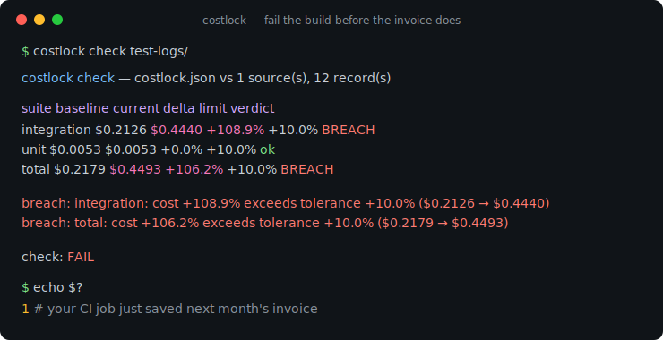
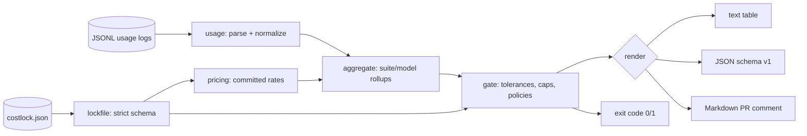

# costlock

[English](README.md) | [中文](README.zh.md) | [日本語](README.ja.md)

[](LICENSE) [](go.mod) [](CHANGELOG.md)  [](CONTRIBUTING.md)

**costlock：オープンソースの CI 向けバジェットロックファイル——テスト実行が出力する LLM 使用量ログを解析し、コスト回帰でビルドを失敗させる。トークン支出の膨張を請求書ではなくコードレビューの段階で食い止める。**



```bash
git clone https://github.com/JaydenCJ/costlock && cd costlock
go build -o costlock ./cmd/costlock    # single static binary, stdlib only
```

> プレリリース：v0.1.0 はまだどのパッケージレジストリにもタグ付けされていません。上記の通りソースからビルドしてください（Go ≥1.22 なら可）。

## なぜ costlock？

LLM 呼び出しをテスト・評価スイートに組み込んだチームなら、必ずこのバグを出荷したことがある：プロンプトが数段落伸びた、リトライループが呼び出しを倍にした、誰かがフィクスチャを高価なモデルに切り替えた——それでも何も失敗しない。テストは緑のまま、レイテンシも正常に見え、回帰は数週間後に請求書の一行として浮上する。既存ツールは正しいタイミングで阻止できない：可観測性プラットフォームやプロバイダの課金ダッシュボードはマージ*後*の支出しか見えず、テストスイート単位ではなく API キー単位に集計され、どれも pull request を失敗させられない。フロントエンドのチームは何年も前に bundle-size ボットで同じ問題を解決した：予算をコミットし、全 PR をそれと突き合わせ、回帰ならマージをブロックする。costlock はそのトークン支出版だ。テスト実行が既に出力している JSONL 使用量ログを解析し（各プロバイダのフィールド別名を正規化、キャッシュトークンは二重課金しない）、*ロックファイルにコミットされた*価格表で計算する——コスト計算はリポジトリだけで再現できる——そして許容幅とハードキャップ付きのスイート別ベースラインと比較する。予算超過 → exit 1 → 赤いビルド。問題のスイート、増加率、ドル金額まで正確に引用される。

| | costlock | 課金ダッシュボード | LLM 可観測性プラットフォーム | bundle-size ボット |
|---|---|---|---|---|
| コスト回帰でビルドを失敗させる | ✅ exit 1 | ❌ | ❌ マージ後のアラート | ✅ ただし JS バイト |
| 予算はレビュー可能なコミット済みファイル | ✅ | ❌ | ❌ Web コンソール | ✅ |
| テストスイート単位の粒度 | ✅ | ❌ API キー単位 | ⚠️ トレース単位、SDK 必須 | 対象外 |
| 再現可能なオフラインのコスト計算 | ✅ 価格はロックファイル内 | ❌ | ❌ サーバ側 | ✅ |
| ログから動く、SDK もプロキシも不要 | ✅ JSONL 入力 | 対象外 | ❌ 計装かプロキシ | 対象外 |
| ランタイム依存 | 0 | 対象外（SaaS） | エージェント + バックエンド | Node + 依存 |

<sub>依存数は 2026-07-13 に確認：costlock は Go 標準ライブラリのみを import する。</sub>

## 機能

- **ダッシュボードではなくロックファイル** — `costlock.json` がベースライン・許容幅・上限・価格を保持。予算変更は、それを引き起こした同じ PR にレビュー可能な diff として現れる。
- **実行が既に記録しているものを解析** — ネストにもフラットにも対応、`input_tokens`/`prompt_tokens` と `output_tokens`/`completion_tokens` の別名、独立したキャッシュフィールド、記録済み `cost_usd`；不正な行は `file:line` 付きで失敗。
- **正直なキャッシュ課金** — OpenAI 式の `cached_tokens` 部分集合は入力バケットから切り出してキャッシュ読み取り単価で計算。キャッシュトークンに二度課金することは決してない。
- **設計からして決定的** — 価格はリポジトリ毎にコミット（勝手に変わる内蔵ベンダー料金は無い）、直列化はバイト単位で安定、変化のない実行への `update` は何も変えない。
- **閾値ではなくポリシー** — 相対許容幅と警告レベル、ドル/呼び出し数/トークンの絶対上限、スイート別オーバーライド、新規スイート・欠落スイート・価格未設定モデルへの明示的な `fail`/`warn`/`ignore`。
- **CI ネイティブな出力** — ログ向けテキスト表、ツール向けの安定 JSON（`schema_version: 1`）、PR コメント向け Markdown；終了コード 0/1/2/3。
- **依存ゼロ、完全オフライン** — Go 標準ライブラリのみ。ローカルファイルを読むだけで、どこにも接続せず、何も送信しない。

## クイックスタート

```bash
# 1. baseline a known-good run, commit the result
./costlock init --prices examples/prices.json examples/usage.baseline.jsonl
git add costlock.json

# 2. in CI, after the test run
./costlock check examples/usage.regression.jsonl
```

実際にキャプチャした出力（終了コード 1）：

```text
costlock check — costlock.json vs 1 source(s), 12 record(s)

suite          baseline     current     delta     limit  verdict
integration     $0.2126     $0.4440   +108.9%    +10.0%  BREACH
unit            $0.0053     $0.0053     +0.0%    +10.0%  ok
total           $0.2179     $0.4493   +106.2%    +10.0%  BREACH

breach: integration: cost +108.9% exceeds tolerance +10.0% ($0.2126 → $0.4440)
breach: total: cost +106.2% exceeds tolerance +10.0% ($0.2179 → $0.4493)

check: FAIL
```

意図した回帰だった？ならばリードが読める diff で明示的に受け入れる（`costlock update`、実出力）：

```text
updated costlock.json: 2 baseline(s) refreshed, 0 suite(s) added, 0 pruned
```

`costlock report` はゲートせずに実行を要約する（実出力）：

```text
costlock report — 1 source(s), 11 record(s)

total cost   $0.2179
calls        11
tokens       58,986 in / 7,714 out / 21,024 cache-read / 8,000 cache-write

by suite         calls          cost
  integration        3       $0.2126
  unit               8       $0.0053

by model                        calls     in tokens    out tokens          cost
  claude-sonnet-4-5-20250929        3        36,200         4,532       $0.2126
  gpt-4o-mini-2024-07-18            8        22,786         3,182       $0.0053
```

## ロックファイル

`costlock.json` は厳格（未知フィールドは拒否——タイポがゲートを黙って無効化することはあり得ない）かつ決定的。完全なリファレンスは [docs/lockfile-format.md](docs/lockfile-format.md)。

| キー | デフォルト | 効果 |
|---|---|---|
| `policy.tolerance_pct` | `10` | スイートが違反（breach）になるまでに許すベースライン比のコスト増加 |
| `policy.warn_pct` | `5` | 警告を表示しつつ 0 で終了する増加率 |
| `policy.on_new_suite` | `fail` | 実行にあってロックファイルに無いスイート：`fail`、`warn`、`ignore` |
| `policy.on_missing_suite` | `warn` | 予算があるのに実行に現れないスイート |
| `policy.on_unpriced` | `fail` | 記録コストも価格マッチも無いレコード |
| `policy.prefer_recorded_cost` | `true` | ログ内の `cost_usd` が価格表より優先 |
| `prices.<model or prefix*>` | — | 100 万トークンあたりの USD：入力、出力、キャッシュ読/書 |
| `budgets.<suite>.max_cost_usd` | 未設定 | ベースラインとは独立した絶対上限 |
| `budgets.<suite>.max_calls` / `max_input_tokens` / `max_output_tokens` | 未設定 | 絶対量の上限 |
| `budgets.<suite>.tolerance_pct` | 未設定 | スイート別の許容幅オーバーライド |
| `total` | init が書き込む | 同じ予算構造で実行全体をゲート |

## CLI リファレンス

`costlock <init|check|update|report|version> [flags] <logs...>` — ログは JSONL ファイル、ディレクトリ（再帰的に `*.jsonl`/`*.ndjson`）、または `-`（stdin）。終了コード：0 正常、1 違反、2 用法エラー、3 実行時エラー。

| フラグ | デフォルト | 効果 |
|---|---|---|
| `--lockfile` | `costlock.json` | ロックファイルの場所 |
| `--suite-key` | 自動（`suite`、`test`、`group`、`tags.suite`） | スイート名となるドット区切り JSON パス |
| `--format`（check、report） | `text` | `text`、`json`、`markdown` |
| `--fail-on-warn`（check） | オフ | 警告でも 1 で終了 |
| `--prices`（init） | — | 新しいロックファイルに埋め込む JSON 価格表 |
| `--tolerance` / `--warn`（init） | `10` / `5` | 初期ポリシーのパーセント値 |
| `--allow-unpriced`（init） | オフ | 一部レコードが計算不能でもベースライン化する |
| `--force`（init） | オフ | 既存ロックファイルを上書き |
| `--suite`（update） | 全部 | このスイートのベースラインだけ更新（複数可） |
| `--prune`（update） | オフ | 実行に無いスイートの予算を削除 |

## 検証

このリポジトリは CI を同梱しない。上記の主張はすべてローカル実行で検証される：

```bash
go test ./...            # 92 deterministic tests, offline, < 5 s
bash scripts/smoke.sh    # end-to-end CLI check, prints SMOKE OK
```

## アーキテクチャ



## ロードマップ

- [x] v0.1.0 — プロバイダ別名対応の JSONL 解析、コミット式価格表、厳格で決定的なロックファイル、init/check/update/report、許容幅 + 上限 + ポリシー、text/JSON/Markdown 出力、92 テスト + smoke スクリプト
- [ ] `costlock diff` — ロックファイルに触れず 2 つの実行を直接比較
- [ ] OpenTelemetry GenAI スパンとプロバイダ一括エクスポート形式のネイティブアダプタ
- [ ] スイート内モデル別予算（合計が安定したままのモデル差し替え回帰を捕捉）
- [ ] Markdown 表を PR コメントとして投稿する GitHub Action ラッパー
- [ ] USD 以外の通貨表示

完全なリストは [open issues](https://github.com/JaydenCJ/costlock/issues) を参照。

## コントリビュート

Issue・ディスカッション・pull request を歓迎——ローカルのワークフロー（format、vet、テスト、`SMOKE OK`）は [CONTRIBUTING.md](CONTRIBUTING.md) を参照。入門タスクは [good first issue](https://github.com/JaydenCJ/costlock/issues?q=is%3Aissue+is%3Aopen+label%3A%22good+first+issue%22) のラベル付き、設計の議論は [Discussions](https://github.com/JaydenCJ/costlock/discussions) で。

## ライセンス

[MIT](LICENSE)
