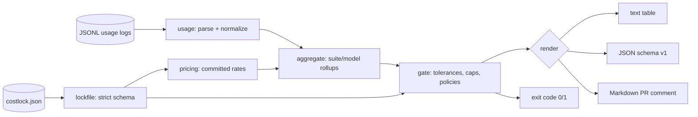

# costlock

[English](README.md) | [中文](README.zh.md) | [日本語](README.ja.md)

[](LICENSE) [](go.mod) [](CHANGELOG.md)  [](CONTRIBUTING.md)

**costlock：an open-source budget lockfile for CI — it parses the LLM usage logs your test runs emit and fails the build on cost regressions, so token-spend bloat is caught in review, not on the invoice.**


```bash
git clone https://github.com/JaydenCJ/costlock && cd costlock
go build -o costlock ./cmd/costlock    # single static binary, stdlib only
```

> Pre-release: v0.1.0 is not tagged on a package registry yet; build from source as above (any Go ≥1.22).

## Why costlock?

Every team wiring LLM calls into their test and eval suites has shipped this bug: a prompt grows a few paragraphs, a retry loop doubles its calls, someone flips a fixture to a pricier model — and nothing fails. Tests stay green, latency looks fine, and the regression surfaces weeks later as a line item on the invoice. The existing tooling can't catch it at the right moment: observability platforms and provider billing dashboards see spend *after* merge, aggregated per API key rather than per test suite, and none of them can fail a pull request. Frontend teams solved the identical problem years ago with bundle-size bots: commit a budget, diff every PR against it, block the merge on regression. costlock is that, for token spend. It parses the JSONL usage logs your test run already produces (provider field aliases normalized, cached tokens never double-charged), prices them against a table committed *in the lockfile* so the math is reproducible from the repo alone, and compares the result to per-suite baselines with tolerances and hard caps. Over budget → exit 1 → red build, with the exact suite, delta, and dollar figures quoted.

| | costlock | billing dashboards | LLM observability platforms | bundle-size bots |
|---|---|---|---|---|
| Fails the build on cost regression | ✅ exit 1 | ❌ | ❌ alerts after merge | ✅ but for JS bytes |
| Budget lives in a committed, reviewable file | ✅ | ❌ | ❌ web console | ✅ |
| Per-test-suite granularity | ✅ | ❌ per API key | ⚠️ per trace, needs SDK | n/a |
| Reproducible offline cost math | ✅ prices in lockfile | ❌ | ❌ server-side | ✅ |
| Works from logs, no SDK or proxy | ✅ JSONL in | n/a | ❌ instrument or proxy | n/a |
| Runtime dependencies | 0 | n/a SaaS | agent + backend | Node + deps |

<sub>Dependency count checked 2026-07-13: costlock imports the Go standard library only.</sub>

## Features

- **A lockfile, not a dashboard** — `costlock.json` holds baselines, tolerances, caps, and prices; budget changes arrive as reviewable diffs in the same PR that causes them.
- **Parses what your runs already log** — nested or flat records, `input_tokens`/`prompt_tokens` and `output_tokens`/`completion_tokens` aliases, separate cache fields, recorded `cost_usd`; malformed lines fail with `file:line`.
- **Honest cache accounting** — OpenAI-style `cached_tokens` subsets are carved out of the input bucket and priced at the cache-read rate, so cached tokens are never charged twice.
- **Deterministic by construction** — prices are committed per-repo (no built-in vendor rates to silently change), serialization is byte-stable, and `update` on an unchanged run churns nothing.
- **Policy, not just a threshold** — relative tolerance plus warn level, absolute caps on dollars/calls/tokens, per-suite overrides, and explicit `fail`/`warn`/`ignore` policies for new suites, missing suites, and unpriced models.
- **CI-native output** — text tables for logs, stable JSON (`schema_version: 1`) for tooling, Markdown for PR comments; exit codes 0/1/2/3.
- **Zero dependencies, fully offline** — Go standard library only; reads local files, talks to nothing, sends nothing.

## Quickstart

```bash
# 1. baseline a known-good run, commit the result
./costlock init --prices examples/prices.json examples/usage.baseline.jsonl
git add costlock.json

# 2. in CI, after the test run
./costlock check examples/usage.regression.jsonl
```

Real captured output (exit code 1):

```text
costlock check — costlock.json vs 1 source(s), 12 record(s)

suite          baseline     current     delta     limit  verdict
integration     $0.2126     $0.4440   +108.9%    +10.0%  BREACH
unit            $0.0053     $0.0053     +0.0%    +10.0%  ok
total           $0.2179     $0.4493   +106.2%    +10.0%  BREACH

breach: integration: cost +108.9% exceeds tolerance +10.0% ($0.2126 → $0.4440)
breach: total: cost +106.2% exceeds tolerance +10.0% ($0.2179 → $0.4493)

check: FAIL
```

The regression was intentional? Accept it explicitly, in a diff your lead can read (`costlock update`, real output):

```text
updated costlock.json: 2 baseline(s) refreshed, 0 suite(s) added, 0 pruned
```

And `costlock report` summarizes any run without gating (real output):

```text
costlock report — 1 source(s), 11 record(s)

total cost   $0.2179
calls        11
tokens       58,986 in / 7,714 out / 21,024 cache-read / 8,000 cache-write

by suite         calls          cost
  integration        3       $0.2126
  unit               8       $0.0053

by model                        calls     in tokens    out tokens          cost
  claude-sonnet-4-5-20250929        3        36,200         4,532       $0.2126
  gpt-4o-mini-2024-07-18            8        22,786         3,182       $0.0053
```

## The lockfile

`costlock.json` is strict (unknown fields are rejected — a typo can never silently disable a gate) and deterministic. Full reference in [docs/lockfile-format.md](docs/lockfile-format.md).

| Key | Default | Effect |
|---|---|---|
| `policy.tolerance_pct` | `10` | allowed cost growth over baseline before a suite breaches |
| `policy.warn_pct` | `5` | growth that prints a warning but still exits 0 |
| `policy.on_new_suite` | `fail` | suite in the run but not in the lockfile: `fail`, `warn`, `ignore` |
| `policy.on_missing_suite` | `warn` | budgeted suite absent from the run |
| `policy.on_unpriced` | `fail` | records with no recorded cost and no matching price |
| `policy.prefer_recorded_cost` | `true` | a `cost_usd` in the log wins over the price table |
| `prices.<model or prefix*>` | — | USD per million tokens: input, output, cache read/write |
| `budgets.<suite>.max_cost_usd` | unset | absolute ceiling, independent of the baseline |
| `budgets.<suite>.max_calls` / `max_input_tokens` / `max_output_tokens` | unset | absolute volume caps |
| `budgets.<suite>.tolerance_pct` | unset | per-suite tolerance override |
| `total` | written by init | same budget shape, gating the whole run |

## CLI reference

`costlock <init|check|update|report|version> [flags] <logs...>` — logs are JSONL files, directories (recursive `*.jsonl`/`*.ndjson`), or `-` for stdin. Exit codes: 0 ok, 1 breach, 2 usage error, 3 runtime error.

| Flag | Default | Effect |
|---|---|---|
| `--lockfile` | `costlock.json` | lockfile location |
| `--suite-key` | auto (`suite`, `test`, `group`, `tags.suite`) | dotted JSON path that names the suite |
| `--format` (check, report) | `text` | `text`, `json`, or `markdown` |
| `--fail-on-warn` (check) | off | exit 1 on warnings too |
| `--prices` (init) | — | JSON price table to embed in the new lockfile |
| `--tolerance` / `--warn` (init) | `10` / `5` | initial policy percentages |
| `--allow-unpriced` (init) | off | baseline even when some records cannot be priced |
| `--force` (init) | off | overwrite an existing lockfile |
| `--suite` (update) | all | refresh only this suite's baseline (repeatable) |
| `--prune` (update) | off | drop budgets for suites absent from the run |

## Verification

This repository ships no CI; every claim above is verified by local runs:

```bash
go test ./...            # 92 deterministic tests, offline, < 5 s
bash scripts/smoke.sh    # end-to-end CLI check, prints SMOKE OK
```

## Architecture



## Roadmap

- [x] v0.1.0 — JSONL parsing with provider aliases, committed price tables, strict deterministic lockfile, init/check/update/report, tolerance + caps + policies, text/JSON/Markdown output, 92 tests + smoke script
- [ ] `costlock diff` — compare two runs directly, without touching the lockfile
- [ ] Native adapters for OpenTelemetry GenAI spans and provider batch-export formats
- [ ] Per-model budgets inside a suite (catch model-swap regressions with stable totals)
- [ ] GitHub Action wrapper that posts the Markdown table as a PR comment
- [ ] Currency display other than USD

See the [open issues](https://github.com/JaydenCJ/costlock/issues) for the full list.

## Contributing

Issues, discussions and pull requests are welcome — see [CONTRIBUTING.md](CONTRIBUTING.md) for the local workflow (format, vet, tests, `SMOKE OK`). Good entry points are labelled [good first issue](https://github.com/JaydenCJ/costlock/issues?q=is%3Aissue+is%3Aopen+label%3A%22good+first+issue%22), and design questions live in [Discussions](https://github.com/JaydenCJ/costlock/discussions).

## License

[MIT](LICENSE)
