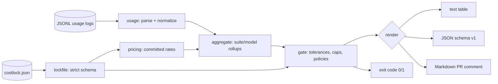

# costlock

[English](README.md) | [中文](README.zh.md) | [日本語](README.ja.md)

[](LICENSE) [](go.mod) [](CHANGELOG.md)  [](CONTRIBUTING.md)

**costlock：开源的 CI 预算锁文件（budget lockfile）——解析测试运行产生的 LLM 用量日志，在成本回归时让构建失败，把 token 开销膨胀拦截在代码评审阶段，而不是等到账单上。**


```bash
git clone https://github.com/JaydenCJ/costlock && cd costlock
go build -o costlock ./cmd/costlock    # single static binary, stdlib only
```

> 预发布：v0.1.0 尚未在任何包注册表上打 tag；请按上面的方式从源码构建（任意 Go ≥1.22）。

## 为什么选 costlock？

每个把 LLM 调用接进测试和评测套件的团队都发布过这个 bug：提示词多长了几段、某个重试循环把调用翻倍、有人把 fixture 换成了更贵的模型——却什么都没有失败。测试依然全绿，延迟看起来正常，回归几周后才作为账单上的一行浮出水面。现有工具无法在正确的时机拦截它：可观测性平台和厂商账单面板只能看到合并*之后*的开销，按 API key 而不是按测试套件聚合，而且没有一个能让 pull request 失败。前端团队多年前就用 bundle-size 机器人解决了同样的问题：提交一份预算，每个 PR 与之对比，回归即阻止合并。costlock 就是它的 token 开销版。它解析测试运行本来就会产出的 JSONL 用量日志（归一化各厂商字段别名，缓存 token 绝不重复计费），用*提交在锁文件里*的价格表计价——成本数学仅凭仓库即可复现——再与带容差和硬上限的按套件基线对比。超出预算 → exit 1 → 构建变红，并精确引用出问题的套件、增幅和美元数字。

| | costlock | 账单面板 | LLM 可观测性平台 | bundle-size 机器人 |
|---|---|---|---|---|
| 成本回归时让构建失败 | ✅ exit 1 | ❌ | ❌ 合并后才告警 | ✅ 但只管 JS 字节 |
| 预算存放在可评审的提交文件中 | ✅ | ❌ | ❌ 网页控制台 | ✅ |
| 按测试套件的粒度 | ✅ | ❌ 按 API key | ⚠️ 按 trace，需 SDK | 不适用 |
| 可复现的离线成本计算 | ✅ 价格在锁文件里 | ❌ | ❌ 服务端 | ✅ |
| 直接读日志，无需 SDK 或代理 | ✅ 读入 JSONL | 不适用 | ❌ 需埋点或代理 | 不适用 |
| 运行时依赖 | 0 | 不适用（SaaS） | agent + 后端 | Node + 依赖 |

<sub>依赖数核对于 2026-07-13：costlock 只导入 Go 标准库。</sub>

## 功能

- **是锁文件，不是仪表盘** — `costlock.json` 承载基线、容差、上限和价格；预算变更以可评审的 diff 形式出现在引发它的同一个 PR 里。
- **解析你的运行本来就在记录的东西** — 嵌套或扁平记录、`input_tokens`/`prompt_tokens` 与 `output_tokens`/`completion_tokens` 别名、独立缓存字段、记录的 `cost_usd`；畸形行报错并带 `file:line`。
- **诚实的缓存计费** — OpenAI 式 `cached_tokens` 子集会从输入桶中剥离并按缓存读取费率计价，缓存 token 绝不被收两次钱。
- **构造即确定性** — 价格按仓库提交（没有会悄悄变化的内置厂商费率），序列化字节级稳定，对未变化的运行执行 `update` 不产生任何改动。
- **是策略，不只是阈值** — 相对容差加警告线、美元/调用数/token 的绝对上限、按套件覆写，以及针对新套件、缺失套件、无价格模型的显式 `fail`/`warn`/`ignore` 策略。
- **CI 原生输出** — 面向日志的文本表格、面向工具链的稳定 JSON（`schema_version: 1`）、面向 PR 评论的 Markdown；退出码 0/1/2/3。
- **零依赖，完全离线** — 仅 Go 标准库；只读本地文件，不连接任何东西，不发送任何东西。

## 快速上手

```bash
# 1. baseline a known-good run, commit the result
./costlock init --prices examples/prices.json examples/usage.baseline.jsonl
git add costlock.json

# 2. in CI, after the test run
./costlock check examples/usage.regression.jsonl
```

真实捕获的输出（退出码 1）：

```text
costlock check — costlock.json vs 1 source(s), 12 record(s)

suite          baseline     current     delta     limit  verdict
integration     $0.2126     $0.4440   +108.9%    +10.0%  BREACH
unit            $0.0053     $0.0053     +0.0%    +10.0%  ok
total           $0.2179     $0.4493   +106.2%    +10.0%  BREACH

breach: integration: cost +108.9% exceeds tolerance +10.0% ($0.2126 → $0.4440)
breach: total: cost +106.2% exceeds tolerance +10.0% ($0.2179 → $0.4493)

check: FAIL
```

回归是有意为之？那就显式接受它，以一份负责人读得懂的 diff（`costlock update`，真实输出）：

```text
updated costlock.json: 2 baseline(s) refreshed, 0 suite(s) added, 0 pruned
```

`costlock report` 则只汇总不把关（真实输出）：

```text
costlock report — 1 source(s), 11 record(s)

total cost   $0.2179
calls        11
tokens       58,986 in / 7,714 out / 21,024 cache-read / 8,000 cache-write

by suite         calls          cost
  integration        3       $0.2126
  unit               8       $0.0053

by model                        calls     in tokens    out tokens          cost
  claude-sonnet-4-5-20250929        3        36,200         4,532       $0.2126
  gpt-4o-mini-2024-07-18            8        22,786         3,182       $0.0053
```

## 锁文件

`costlock.json` 是严格的（未知字段一律拒绝——一个拼写错误永远不可能悄悄关掉一道闸门）且确定性的。完整参考见 [docs/lockfile-format.md](docs/lockfile-format.md)。

| 键 | 默认值 | 效果 |
|---|---|---|
| `policy.tolerance_pct` | `10` | 套件违规（breach）前允许的相对基线成本增幅 |
| `policy.warn_pct` | `5` | 打印警告但仍以 0 退出的增幅 |
| `policy.on_new_suite` | `fail` | 运行中有而锁文件中没有的套件：`fail`、`warn`、`ignore` |
| `policy.on_missing_suite` | `warn` | 已列预算却未出现在运行中的套件 |
| `policy.on_unpriced` | `fail` | 既无记录成本又匹配不到价格的记录 |
| `policy.prefer_recorded_cost` | `true` | 日志中的 `cost_usd` 优先于价格表 |
| `prices.<model or prefix*>` | — | 每百万 token 的美元价：输入、输出、缓存读/写 |
| `budgets.<suite>.max_cost_usd` | 未设置 | 与基线无关的绝对上限 |
| `budgets.<suite>.max_calls` / `max_input_tokens` / `max_output_tokens` | 未设置 | 绝对用量上限 |
| `budgets.<suite>.tolerance_pct` | 未设置 | 按套件覆写容差 |
| `total` | 由 init 写入 | 同样的预算结构，把关整个运行 |

## CLI 参考

`costlock <init|check|update|report|version> [flags] <logs...>` — 日志可以是 JSONL 文件、目录（递归 `*.jsonl`/`*.ndjson`）或 `-`（stdin）。退出码：0 正常，1 违规，2 用法错误，3 运行时错误。

| 标志 | 默认值 | 效果 |
|---|---|---|
| `--lockfile` | `costlock.json` | 锁文件位置 |
| `--suite-key` | 自动（`suite`、`test`、`group`、`tags.suite`） | 命名套件的点分 JSON 路径 |
| `--format`（check、report） | `text` | `text`、`json` 或 `markdown` |
| `--fail-on-warn`（check） | 关 | 警告也以 1 退出 |
| `--prices`（init） | — | 嵌入新锁文件的 JSON 价格表 |
| `--tolerance` / `--warn`（init） | `10` / `5` | 初始策略百分比 |
| `--allow-unpriced`（init） | 关 | 即使部分记录无法计价也建立基线 |
| `--force`（init） | 关 | 覆盖已存在的锁文件 |
| `--suite`（update） | 全部 | 只刷新该套件的基线（可重复） |
| `--prune`（update） | 关 | 删除运行中不存在的套件预算 |

## 验证

本仓库不附带 CI；上面的每一条声明都由本地运行验证：

```bash
go test ./...            # 92 deterministic tests, offline, < 5 s
bash scripts/smoke.sh    # end-to-end CLI check, prints SMOKE OK
```

## 架构



## 路线图

- [x] v0.1.0 — 带厂商别名的 JSONL 解析、提交式价格表、严格且确定性的锁文件、init/check/update/report、容差 + 上限 + 策略、text/JSON/Markdown 输出、92 个测试 + smoke 脚本
- [ ] `costlock diff` — 直接对比两次运行，不动锁文件
- [ ] OpenTelemetry GenAI span 与厂商批量导出格式的原生适配器
- [ ] 套件内按模型的预算（在总量稳定时捕捉换模型的回归）
- [ ] 把 Markdown 表格发成 PR 评论的 GitHub Action 封装
- [ ] USD 以外的货币显示

完整列表见 [open issues](https://github.com/JaydenCJ/costlock/issues)。

## 贡献

欢迎 issue、讨论与 pull request——本地工作流（format、vet、测试、`SMOKE OK`）见 [CONTRIBUTING.md](CONTRIBUTING.md)。入门任务标记为 [good first issue](https://github.com/JaydenCJ/costlock/issues?q=is%3Aissue+is%3Aopen+label%3A%22good+first+issue%22)，设计讨论在 [Discussions](https://github.com/JaydenCJ/costlock/discussions)。

## 许可证

[MIT](LICENSE)
